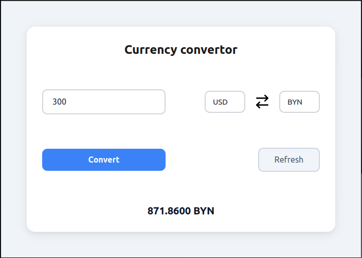

### Currency Converter (Qt/C++)

Простой конвертер валют с актуальными курсами от Национального банка Беларуси.



## Возможности

- Конвертация 7 валют: USD, EUR, RUB, BYN, GBP, CNY, KZT
- Актуальные курсы через API НБРБ
- Обновление курсов по кнопке **Refresh**

## Стек технологий

- **C++ (Qt 6/5)**
- **Qt Network** — HTTP-запросы к API
- **Qt Svg** — иконка Swap
- **CMake** — система сборки

### Как собрать и запустить

## Требования
- Qt 5.15 или выше
- CMake 3.5+

## Сборка и запуск

```bash
mkdir build && cd build
cmake ..
make
./my-convertor-qt
